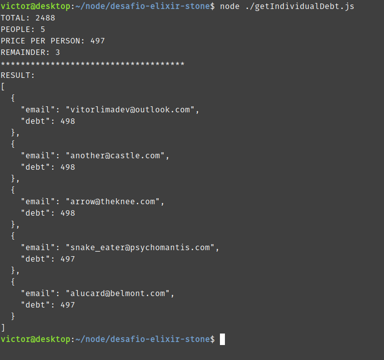

# Programa de Formação em Elixir (Stone)

## About

This application is part of a test to qualify for a Elixir and functional programming training at [Stone](https://www.stone.com.br/).

The application consists on a function that takes an array of emails and an array of shopping list items, sums the value of all items, divides it by the number of emails, and returns an array of objects containing an email and an amount of equal debt for each email.

- The shopping list items price is represented in brazillian cents. So every 100 = 1 BRL.
- If there's any remainder in the division, it will be distributed to all emails equally from the first to the last.
- As the test specified, all numbers should be integers. Adding floating points may result in incorrect result.
- The application will throw an error if you try to use an empty list or an undefined/null value as a param.

## Running the application

[**NodeJS**](https://nodejs.org/en/) is required.

Navigate to the root folder of the project and run:

```sh
node ./getIndividualDebt.js
```

This will run the application with the default values present in the getIndividualDebt.js file.

The default output:



## Changing data

In the beggining of the getIndividualDebt.js file, you'll see two arrays, one to store the emails list and another to store the shopping list data. This is the default data, used when you run the application without changing anything.

```js
const emailsList = [
  "another@castle.com",
  "arrow@theknee.com",
  "snake_eater@psychomantis.com",
  "alucard@belmont.com",
];

const shoopingItemsList = [
  {
    amount: 1,
    itemName: "Assault Cuirass",
    price: 2000,
  },
  {
    amount: 1,
    itemName: "Tango",
    price: 202,
  },
  {
    amount: 2,
    itemName: "Iron branch",
    price: 143,
  },
];
```

The getIndividualDebt function is called with this data and returns the final awnser to the test on the shell.

```js
getIndividualDebt(emailsList, shoopingItemsList);
```

If you want to use a mocking library, or any other source of data to test, you can import the function as a module.

```js
import getIndividualDebt from "./getIndividualDebt";
```
